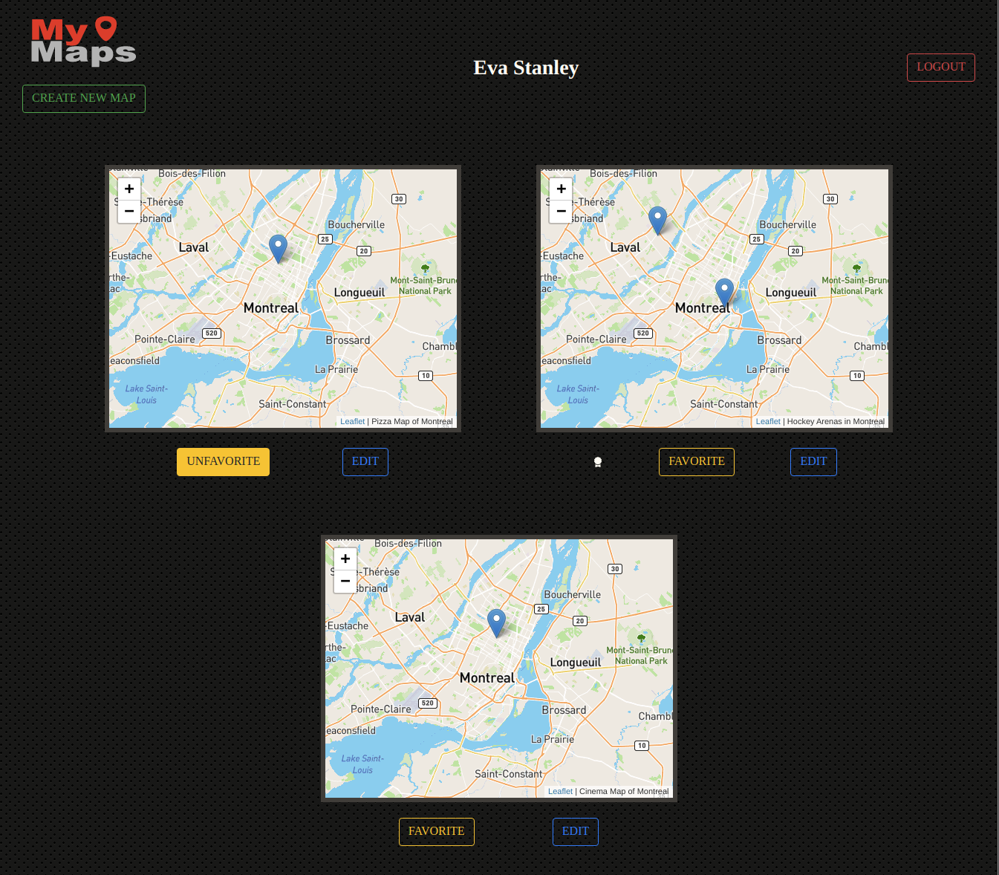
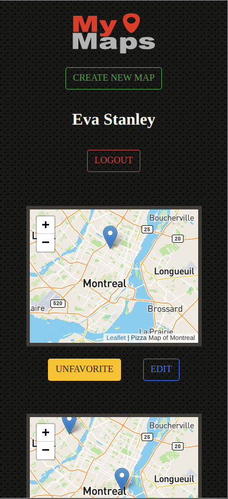
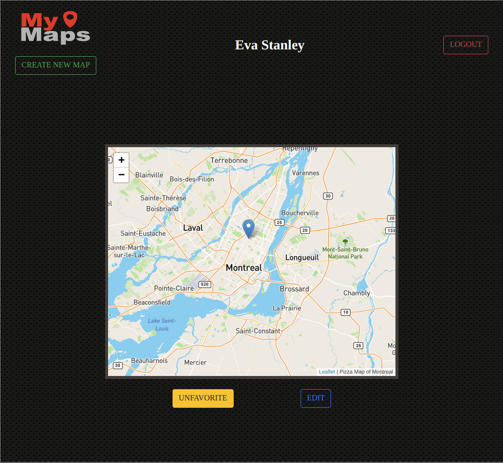
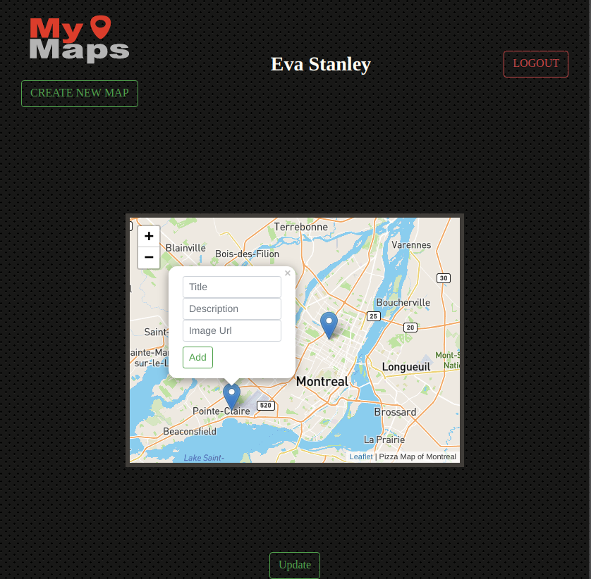

# MyMaps

A web app project for LHL Bootcamp. MyMaps allows authenticated users to create custom maps and group any points of interest "pins" they desire.

# Project Setup

1. Install dependencies: npm i

2. Fix to binaries for sass: npm rebuild node-sass 

3. Set env database settings, user, and create  a labbers database. 

4. Reset database: npm run db:reset
    - Check the db folder to see what gets created and seeded in the SDB

4. Run the server: npm run local
    - Note: nodemon is used, so you should not have to restart your server

5. Visit http://localhost:8080/users/maps

# Dependencies

* "body-parser": "^1.19.0",
* "chalk": "^2.4.2",
* "cookie-session": "^1.4.0",
* "dotenv": "^2.0.0",
* "ejs": "^2.6.2",
* "express": "^4.17.1",
* "morgan": "^1.9.1",
* "node-sass-middleware": "^0.11.0",
* "pg": "^6.4.2",
* "pg-native": "^3.0.0"

# ERD
! ["Final version of the ERD"](docs/ERD/ERD_final.png)

# Screenshots

